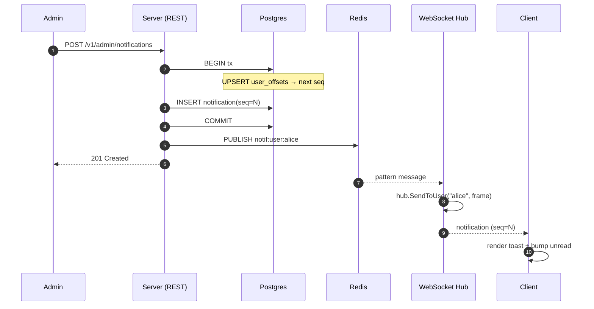
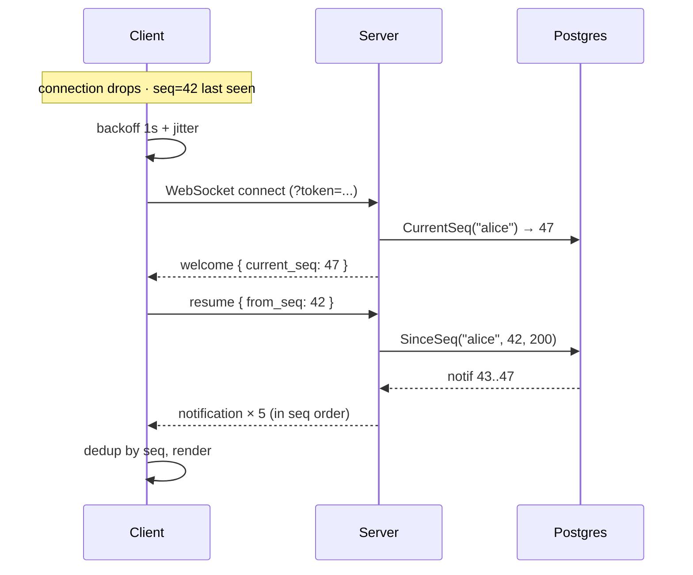

# RealtimeHub

> 50 000-connection WebSocket fan-out for in-app notifications. `lesismal/nbio` epoll engine, sharded hub, Redis pub-sub for cross-node delivery, and sequence-based recovery so reconnecting clients catch up cleanly. A React + Redux SPA demonstrates the full UX end-to-end.

[](https://github.com/liliksetyawan/realtimehub/actions/workflows/ci.yml)


---

## Why this exists

Most "real-time demo" repos pick `gorilla/websocket`, open chat in two browser tabs, and call it a day. That's fine for tutorials — it falls over at scale. At 50 000 connections, the goroutine-per-connection model spends ~800 MB on stacks alone, the GC starts working overtime, and a single read/write goroutine pair becomes the bottleneck.

RealtimeHub is the **production-shaped** version of that problem:

- epoll-based netpoll (`lesismal/nbio`) — ~4-8 KB/conn vs 16+ KB
- sharded hub so register/broadcast on different users don't fight one mutex
- bounded write buffers so a slow consumer can't stall the broadcaster
- one ticker reaper instead of 50k per-conn timers
- kernel tuning script + documented load test that backs the number

---

## Architecture

```mermaid
flowchart LR
    Browser((React SPA)) -->|"WebSocket"| WS

    subgraph Node["RealtimeHub node"]
      WS["WebSocket server<br/>(nbio epoll)"]
      Hub["Sharded Hub<br/>(16 shards)"]
      Sub["Redis subscriber"]
      WS <--> Hub
      Sub --> Hub
    end

    Admin([Admin Panel]) -->|"POST /v1/admin/notifications"| WS

    Hub -->|"persist"| PG[(PostgreSQL<br/>notifications)]
    Pub["Redis publisher"] -->|"PUBLISH<br/>notif:user:&#42;"| Redis{{"Redis<br/>pub-sub"}}
    Redis -->|"PSUBSCRIBE"| Sub

    WS -.->|"fan-out via"| Pub
```



A second node added to this picture changes nothing in the code — both nodes just publish to the same Redis pattern and subscribe to it. The local hub on each node delivers to its own connections.

### Saga of a single notification



### Reconnect with replay



---

## Patterns demonstrated

| Pattern | Where | Why it matters |
|---|---|---|
| **Epoll-based netpoll** | `internal/adapter/websocket` (nbio) | ~4 KB/conn instead of ~16 KB; the difference between fitting 50k on a 4 GB VM vs needing 16 GB |
| **Sharded hub** | `hub.go` — 16 shards keyed by `fnv32a(user_id)` | Register/Unregister/Broadcast on different users run in parallel |
| **Bounded write channel** | `connection.go` — buffer 64 per conn | Slow consumers get closed; the broadcaster never blocks |
| **One-timer reaper** | `hub.go` `StartReaper` | One ticker for ping + stale eviction beats 50k per-conn timers |
| **Atomic per-user seq** | `notifications.go` UPSERT on `user_offsets` | Concurrent inserts can't collide; replays are deterministic |
| **Cross-node pub-sub** | `internal/adapter/redis` (rueidis) | Adding a second node = zero code change; rueidis auto-reconnects on drop |
| **Sequence recovery** | `welcome` carries `current_seq`; client sends `resume { from_seq }` | No-message-loss across disconnects without server-side ack store |
| **Exponential backoff + jitter** | `hooks/useWebSocket.ts` | Avoids thundering-herd reconnect after a server restart |
| **JWT at handshake** | `auth/jwt.go` `Authenticate` reads `?token=` | Browsers can't set headers on WS upgrade — query param is the canonical workaround |
| **Hexagonal layout** | `domain` → `port` → `usecase` → `adapter` | Same shape as OrderFlow; easy to swap the publisher (e.g. NATS instead of Redis) |

---

## Tech stack

- **Go 1.25** server
- **lesismal/nbio** WebSocket (epoll netpoll)
- **PostgreSQL 16** persistence — `notifications` + `user_offsets`
- **Redis 7** + **rueidis** for cross-node pub-sub
- **JWT (HS256)** auth (`golang-jwt/jwt/v5`)
- **React 18 + TS + Vite + Redux Toolkit** SPA
- **Tailwind v3** + hand-written shadcn-style components
- **Framer Motion** for the bell badge + list animations
- **k6** for the 50k load test
- **Docker Compose** infra

---

## Quick start

```bash
# 1. Bring up Postgres + Redis + Jaeger
make up

# 2. Run the server
cp .env.example .env
make run                 # listens on :8090

# 3. Run the SPA in another terminal
cd web && npm install && npm run dev   # opens http://localhost:5173
```

Demo users seeded in code:

| username | password | role |
|---|---|---|
| `alice` | `password123` | user |
| `bob` | `password123` | user |
| `charlie` | `password123` | user |
| `admin` | `admin123` | admin |

Workflow:
1. Tab 1 — log in as `alice`. Bell at top right; status pill shows "Connected".
2. Tab 2 — log in as `admin`. Click "Admin", select alice, type a notification, send.
3. Tab 1 receives the notification with no refresh — toast pops, bell badge animates, item appears at the top of the inbox.

To exercise reconnect:
- Stop the server (Ctrl+C). Tab 1 status flips to "Reconnecting · attempt N" with backoff.
- Start the server again. Tab 1 reconnects, sends `resume { from_seq }`, and any notifications you sent while it was offline replay in seq order.

---

## Repository layout

```
realtimehub/
├── cmd/server/main.go              composition root
├── internal/
│   ├── domain/                     pure: Notification, errors
│   ├── app/
│   │   ├── port/                   NotificationRepository, Publisher
│   │   └── usecase/                SendNotification, ListNotifications, MarkRead
│   ├── adapter/
│   │   ├── websocket/              ★ nbio engine + sharded hub + connection lifecycle
│   │   ├── postgres/               pgx repo + migrate runner + history adapter
│   │   ├── redis/                  rueidis publisher + subscriber
│   │   ├── auth/                   JWT issuer/verifier + demo users
│   │   └── http/                   REST handlers (login, list, mark-read, admin send)
│   └── config/                     envconfig
├── migrations/                     SQL + go:embed
├── scripts/tune-kernel.sh          ulimit + sysctl knobs for 50k+
├── loadtest/
│   ├── ramp-50k.js                 k6 5-stage scenario
│   └── README.md                   how to actually run it
└── web/                            React + Redux SPA
    └── src/
        ├── pages/                  Login, Dashboard, Admin
        ├── components/             ui/, layout/, notifications/
        ├── hooks/useWebSocket.ts   ★ reconnect + backoff + resume
        ├── store/                  auth, notifications, ws slices
        └── lib/                    api client, types
```

The frontend's `useWebSocket.ts` is the headline FE piece — 100 lines of code that own the entire connection lifecycle: open with token, respond to server pings, replay missed seqs, exponential-backoff reconnect with jitter, dispatch into Redux on every frame.

---

## Library choice — why nbio

For 50k concurrent WebSocket connections on commodity hardware:

| Library | Model | Memory / conn | At 50k |
|---|---|---|---|
| `gorilla/websocket` | 1 goroutine read + 1 write | ~16 KB | ~800 MB stacks alone |
| `coder/websocket` (eks nhooyr) | Same goroutine model | ~16 KB | ~800 MB stacks |
| `gobwas/ws` + `mailru/easygo/netpoll` | epoll event loop | ~4 KB | ~200 MB |
| **`lesismal/nbio`** ★ | epoll, drop-in `net/http` | ~4-8 KB | ~200-400 MB |

`nbio` lands in the same scale tier as `gobwas+netpoll` but ships with a `net/http`-compatible API, so the REST handlers (login, admin send, list) live on the same engine as the upgrade endpoint — one server, one port. The library is actively maintained and has been used in production by several Chinese tech companies for messaging at scale.

---

## Kernel + ulimit tuning

50k WebSocket connections = 50k file descriptors. Default Linux limits stop you well before that. `scripts/tune-kernel.sh` (Linux only, sudo) sets:

| Knob | Value | Why |
|---|---|---|
| `nofile` | 100000 | One fd per conn + epoll fds |
| `net.core.somaxconn` | 4096 | TCP accept backlog |
| `net.ipv4.tcp_max_syn_backlog` | 8192 | SYN queue size |
| `net.ipv4.ip_local_port_range` | 1024 65535 | Loadgen needs ~50k ephemeral ports |
| `net.ipv4.tcp_tw_reuse` | 1 | Recycle TIME_WAIT slots |
| `net.core.{r,w}mem_max` | 16 MiB | Per-socket buffer cap |

If running under systemd, also add `LimitNOFILE=100000`. Under Docker, pass `--ulimit nofile=100000:100000`.

---

## Load test

```bash
sudo bash scripts/tune-kernel.sh
ulimit -n 100000
API_BASE=http://localhost:8090 WS_URL=ws://localhost:8090 \
  k6 run loadtest/ramp-50k.js
```

The scenario ramps 0 → 5k (30s) → 25k (1m) → 50k (2m), sustains 50k for 5 minutes, then drains. See [`loadtest/README.md`](loadtest/README.md) for run-time expectations and what to monitor.

---

## Tracing

OpenTelemetry tracing covers the full notification fan-out path:

```
HTTP request                  ← otelhttp middleware (root span)
  └─ usecase.SendNotification ← span around Execute
       └─ redis.publish       ← injects W3C `traceparent` into Frame
              ↓ via Redis ↓
            redis.subscribe   ← extracts `traceparent`, child span
              └─ hub.send_to_user ← attributes: user_id, hub.delivered
```

Enable export by setting `OTEL_EXPORTER_OTLP_ENDPOINT=http://localhost:4319` (the Jaeger container's OTLP HTTP port). The endpoint is empty by default — when unset, the tracer is a no-op and the server runs with zero overhead.

Open <http://localhost:16687> for the Jaeger UI and look for service `realtimehub`. A single admin notification produces one trace with five spans linked across the Redis hop via the W3C trace context header carried in `Frame.TraceParent`.

---

## Roadmap

- [x] Phase 0 · scaffold
- [x] Phase 1 · nbio server + sharded hub + ping/pong
- [x] Phase 2 · JWT handshake auth + login endpoint
- [x] Phase 3 · notification persistence + admin REST API
- [x] Phase 4 · multi-node fan-out via Redis pub-sub
- [x] Phase 5 · reconnect + sequence recovery
- [x] Phase 6 · React SPA (login, dashboard, admin)
- [x] Phase 7 · k6 ramp-to-50k + kernel tuning script
- [x] Phase 8 · CI + this README
- [x] Phase 9 · unit tests with gomock + testify (domain 100%, usecase 96%, auth 83%)
- [x] Phase 10 · OpenTelemetry tracing end-to-end (HTTP → use case → Redis pub-sub → hub)
- [ ] Phase 11 · per-user `SUBSCRIBE` (replace wildcard) for very large fleets
- [ ] Phase 12 · ack-based at-least-once delivery + delivery offsets table

---

## License

MIT
